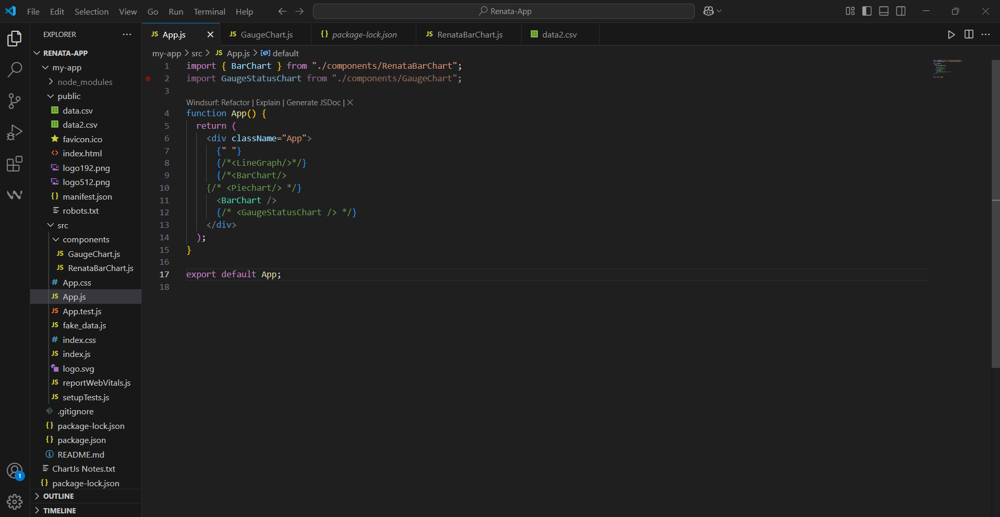
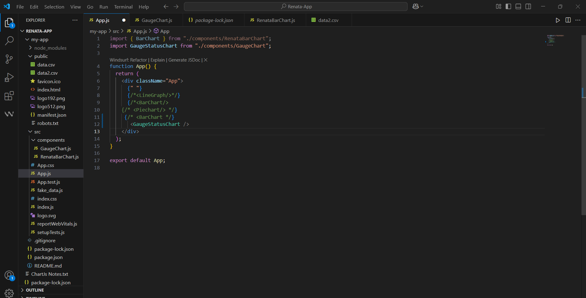
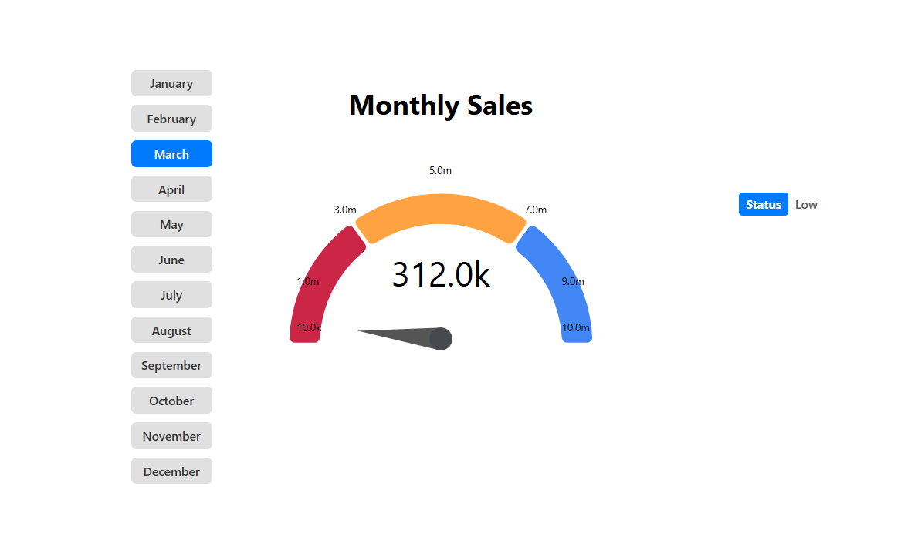
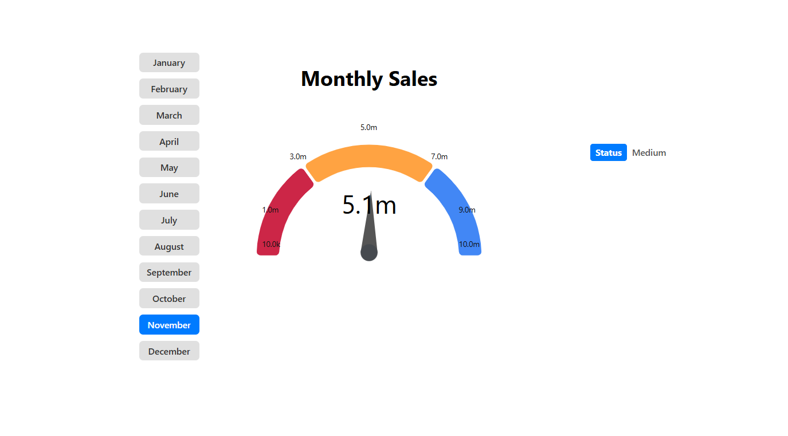
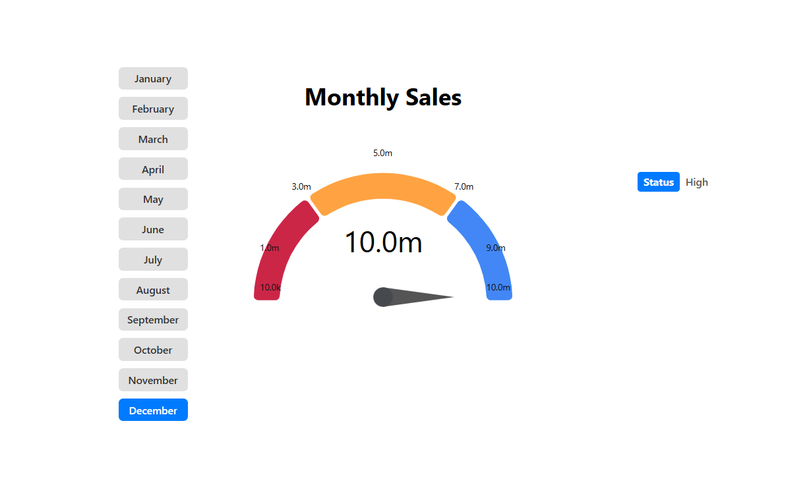
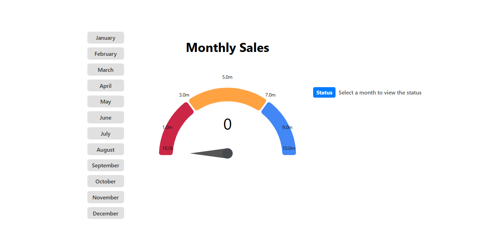
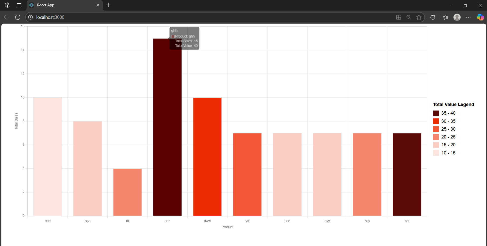
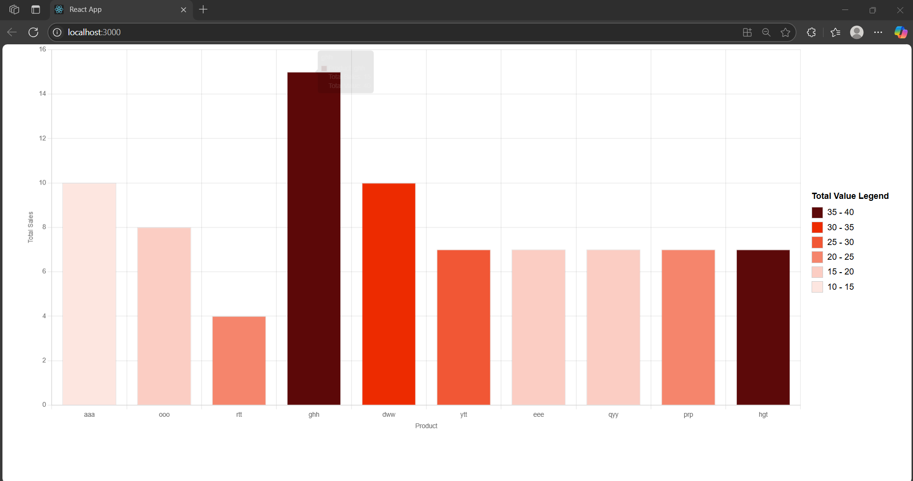

# 📊 Renata Analytics Dashboard (Bar + Gauge)

A modern React-based data visualization program for Renata PLC. This tool supports **two modes** — an interactive Bar Chart (Task 1a) to visualize product sales and a Gauge Chart (Task 1b) to monitor monthly sales. Toggle them easily using JSX: `<BarChart />` or `<GaugeStatusChart />`.

---

## 🌟 Features

* 📈 **Bar Chart View** - Task 1a
  Visualize product-wise total sales and total value from CSV
  → Auto-colored bars with intuitive **legend indicators**

* 🎯 **Gauge Chart View**  - Task 1b
  Select a month to monitor monthly sales against targets
  → Auto-categorized into **Low**, **Medium**, or **High**

* 🧠 Smart status interpretation based on dynamic thresholds

* 📁 Supports **CSV file parsing** using PapaParse

* 🎨 Clean, interactive, responsive visual design

---

## 🛠️ Tech Stack

* **Frontend**: React.js
* **Visualization**: Chart.js (`react-chartjs-2`), `react-gauge-chart`
* **CSV Parsing**: `papaparse`
* **Styling**: Inline styles and minimal CSS

---

## 📂 Project Structure

```
Renata-App/
├── public/
│   ├── data.csv        # Used for bar chart
│   ├── data2.csv       # Used for gauge chart
├── src/
│   ├── components/
│   │   ├── GaugeChart.js        # GaugeStatusChart
│   │   └── RenataBarChart.js    # BarChart
│   ├── App.js          # Toggle charts here
│   ├── App.css
├── package.json
├── README.md
```

---

## 🚀 How to Run

### 1. Clone & Install

```bash
git clone https://github.com/immza/Renata-Frontend.git
cd Renata-Frontend
npm install
```

### 2. Start the App

```bash
npm start
```

> App runs at: `http://localhost:3000`

---

## 🧪 Toggle Chart

In `App.js`:

* To show **Bar Chart**:

  ```jsx
  import { BarChart } from "./components/RenataBarChart";
  <BarChart />
  ```
  
  
* To show **Gauge Chart**:

  

  ```jsx
  import GaugeStatusChart from "./components/GaugeChart";
  <GaugeStatusChart />
  ```

---

## 📸 Screenshots

### 🎯 Gauge Status Chart

| Low Sales            | Medium Sales            | High Sales            |
| -------------------- | ----------------------- | --------------------- |
|  |  |  |

* Default (no month selected):
  

### 📊 Bar Chart

| Tooltip View         | Full Layout          |
| -------------------- | -------------------- |
|  |  |

---

## 🧠 Status Logic

* **Low**: sales ≤ 3M
* **Medium**: 3M < sales < 7M
* **High**: sales ≥ 7M

Gauge automatically reflects the range with intuitive color segments and status labels.

---

## 📦 Data Input

* `data.csv` → used in **Bar Chart**
* `data2.csv` → used in **Gauge Chart**

> CSVs are parsed dynamically using `PapaParse`, no backend required.

---

## 👨‍💻 Author

Built by Moinuddin Zubair Ayan
